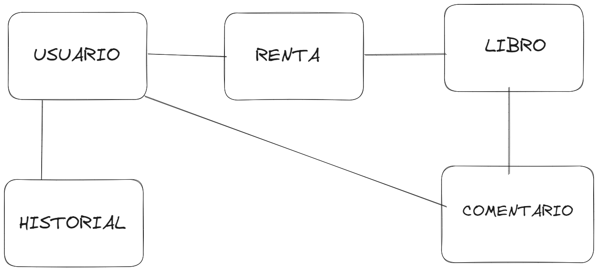
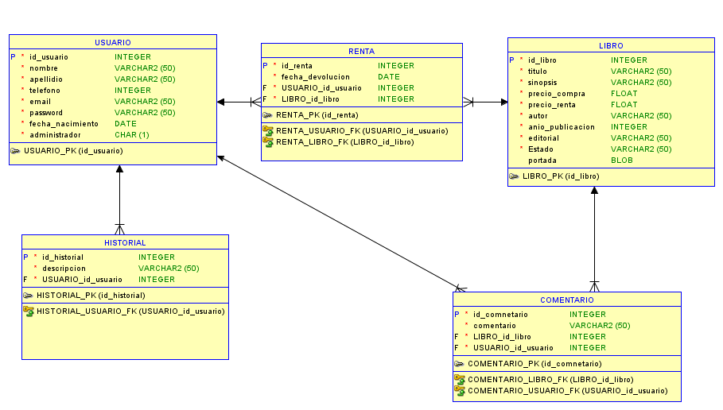

*Universidad de San Carlos de Guatemala*  
*Escuela de Ingeniería en Ciencias y Sistemas, Facultad de Ingenieria*  
*Analisis y Diseño 1,Vacaiones Diciembre 2023.*  

___
## **PROYECTO 1**
___

## **VIDEOS**
https://drive.google.com/drive/folders/1mOHFWy0TiQ4NJ8ejB9PZJdYUwIRNmDfU?usp=sharing
## **MODELOS**
### **MODELO CONCEPTUAL**

### **MODELO LOGICO**

### **MODELO FISICO**

## **DIAGRAMA DE CASOS DE USOS**

## **CASOS DE USOS DE ALTO NIVEL**

| Caso de uso  | CDU-001 Login      |
|--------------|--------------------|
| Actores      | Usuario            |
| Tipo         | Primario, Esencial |
| Descripción  | Se utiliza para que el usuario pueda ingresar a la aplicación mylibrary |

| Caso de uso  | CDU-002 Registrar usuario  |
|--------------|----------------------------|
| Actores      | Usuario                    |
| Tipo         | Secundario                 |
| Descripción  | Se utiliza para la creación de nuevos usuarios dentro de la plataforma de mylibrary. |

| Caso de uso  | CDU-003 Comprar libro  |
|--------------|------------------------|
| Actores      | Usuario                |
| Tipo         | Secundario, Opcional   |
| Descripción  | Se utiliza para que el usuario compre un libro de la plataforma mylibrary. |

| Caso de uso  | CDU-004 Rentar libro  |
|--------------|------------------------|
| Actores      | Usuario                |
| Tipo         | Primario, Opcional     |
| Descripción  | Se utiliza para que el usuario rente un libro de la plataforma mylibrary. |

| Caso de uso  | CDU-005 Devolver libro  |
|--------------|------------------------|
| Actores      | Usuario                |
| Tipo         | Primario, Opcional     |
| Descripción  | Se utiliza para que el usuario devuelva un libro de la plataforma mylibrary que anteriormente había rentado. |

| Caso de uso  | CDU-006 Ingresar comentario  |
|--------------|-----------------------------|
| Actores      | Usuario                     |
| Tipo         | Secundario, Opcional        |
| Descripción  | Se utiliza para que el usuario publique comentarios a un libro. |

| Caso de uso  | CDU-007 Eliminar comentario  |
|--------------|-----------------------------|
| Actores      | Usuario                     |
| Tipo         | Secundario, Opcional        |
| Descripción  | Se utiliza para que el usuario pueda eliminar sus comentarios realizados a un libro. |

| Caso de uso  | CDU-008 Publicar libro      |
|--------------|-----------------------------|
| Actores      | Administrador               |
| Tipo         | Primario, Opcional          |
| Descripción  | Se utiliza para que el administrador pueda ingresar libros a la plataforma mylibrary. |

| Caso de uso  | CDU-009 Eliminar libro      |
|--------------|-----------------------------|
| Actores      | Administrador               |
| Tipo         | Primario, Opcional          |
| Descripción  | Se utiliza para que el administrador pueda eliminar libros que están publicados en la plataforma mylibrary. |

| Caso de uso  | CDU-010 Editar libro        |
|--------------|-----------------------------|
| Actores      | Administrador               |
| Tipo         | Secundario, Opcional          |
| Descripción  | Se utiliza para que el administrador pueda editar los datos de los libros que están publicados en la plataforma mylibrary. |

| Caso de uso  | CDU-011 Eliminar usuario    |
|--------------|-----------------------------|
| Actores      | Administrador               |
| Tipo         | Primario, Opcional          |
| Descripción  | Se utiliza para que el administrador pueda eliminar a usuarios registrados en la plataforma mylibrary. |

## **CASOS DE USOS EXPANDIDOS**

| Caso de uso  | CDU-001 Login               |
|--------------|-----------------------------|
| Actores      | Usuario                     |
| Tipo         | Primario, Esencial          |
| Descripción  | Se utiliza para que el usuario pueda ingresar a la aplicación mylibrary. |
| Flujo normal | 1. El usuario ingresa el correo electrónico. |
|              | 2. El usuario ingresa la contraseña. |
|              | 3. Presiona el botón "Ingresar". |
|              | 4. El sistema busca en la base de datos si el correo existe. |
|              | 5. El sistema valida que el correo y contraseña sean correctas. |
|              | 6. El usuario logra entrar a la plataforma mylibrary. |
| Flujo alterno| - Línea 3: El usuario no ingresa su correo o contraseña, indica error. |
|              | - Línea 5: El sistema indica que el correo o contraseña no es válida, indica error. |

| Caso de uso  | CDU-002 Registrar usuario  |
|--------------|-----------------------------|
| Actores      | Usuario                     |
| Tipo         | Secundario, Opcional        |
| Descripción  | Se utiliza para la creación de nuevos usuarios dentro de la plataforma de mylibrary. |
| Flujo normal | 1. El usuario ingresa todos sus datos. |
|              | 2. El usuario presiona el botón "Registrar". |
|              | 3. El sistema valida que el correo no está registrado. |
|              | 4. El sistema registra al nuevo usuario. |
|              | 5. El usuario se ha creado con éxito. |
| Flujo alterno| - Línea 2: El usuario no ingresó todos los datos obligatorios, indica error. |
|              | - Línea 3: El correo ya está registrado, indica error. |

| Caso de uso  | CDU-003 Comprar libro      |
|--------------|-----------------------------|
| Actores      | Usuario                     |
| Tipo         | Secundario, Opcional        |
| Descripción  | Se utiliza para que el usuario compre un libro de la plataforma mylibrary. |
| Flujo normal | 1. El usuario selecciona el libro que quiere comprar. |
|              | 2. El usuario presiona el botón de comprar. |
|              | 3. El sistema verifica que el libro esté disponible. |
|              | 4. El usuario compra el libro con éxito. |
| Flujo alterno| - Línea 3: El libro no está disponible, indica error. |

| Caso de uso  | CDU-004 Rentar libro      |
|--------------|---------------------------|
| Actores      | Usuario                   |
| Tipo         | Primario, Opcional        |
| Descripción  | Se utiliza para que el usuario rente un libro de la plataforma mylibrary. |
| Flujo normal | 1. El usuario selecciona el libro que quiere rentar. |
|              | 2. El usuario presiona el botón de rentar. |
|              | 3. El sistema verifica que el libro esté disponible. |
|              | 4. El usuario renta el libro con éxito. |
| Flujo alterno| - Línea 3: El libro no está disponible, indica error. |

| Caso de uso  | CDU-005 Devolver libro      |
|--------------|-----------------------------|
| Actores      | Usuario                     |
| Tipo         | Primario, Opcional          |
| Descripción  | Se utiliza para que el usuario devuelva un libro de la plataforma mylibrary que anteriormente había rentado. |
| Flujo normal | 1. El usuario selecciona el libro que quiere devolver. |
|              | 2. El usuario presiona el botón de devolver. |
|              | 3. El usuario ha devuelto el libro con éxito. |
| Flujo alterno|                              |

| Caso de uso  | CDU-006 Ingresar comentario  |
|--------------|-----------------------------|
| Actores      | Usuario                     |
| Tipo         | Primario, Opcional          |
| Descripción  | Se utiliza para que el usuario publique comentarios a un libro. |
| Flujo normal | 1. El usuario selecciona el libro que quiere comentar. |
|              | 2. Presiona el botón de comentar. |
|              | 3. Ingresa el comentario que quiere publicar. |
|              | 4. El sistema ingresa el comentario. |
|              | 5. El usuario ha publicado el comentario. |
| Flujo alterno| - Línea 2: Seleccionó más de un libro, indica error. |
|              | - Línea 2: No seleccionó un libro, indica error. |

| Caso de uso  | CDU-007 Eliminar comentario |
|--------------|-----------------------------|
| Actores      | Usuario                     |
| Tipo         | Primario, Opcional          |
| Descripción  | Se utiliza para que el usuario pueda eliminar sus comentarios realizados a un libro. |
| Flujo normal | 1. El usuario selecciona el libro donde se encuentra el comentario que quiere eliminar. |
|              | 2. El usuario selecciona el comentario que quiere eliminar. |
|              | 3. El usuario presiona el botón eliminar. |
|              | 4. El sistema elimina el comentario. |
|              | 5. El usuario ha eliminado el comentario. |
| Flujo alterno| - Línea 1: No seleccionó el libro, indica error. |

| Caso de uso  | CDU-008 Publicar libro      |
|--------------|-----------------------------|
| Actores      | Administrador               |
| Tipo         | Primario, Opcional          |
| Descripción  | Se utiliza para que el administrador pueda ingresar libros a la plataforma mylibrary. |
| Flujo normal | 1. El administrador ingresa los datos del libro que quiere publicar en la plataforma mylibrary. |
|              | 2. El administrador presiona el botón de publicar libro. |
|              | 3. El sistema ingresa el libro. |
|              | 4. Se publico el libro |
| Flujo alterno| - Línea 2: No ingresó todos los datos del libro, indica error. |

| Caso de uso  | CDU-009 Eliminar libro      |
|--------------|-----------------------------|
| Actores      | Administrador               |
| Tipo         | Primario, Opcional          |
| Descripción  | Se utiliza para que el administrador pueda eliminar libros que están publicados en la plataforma mylibrary.|
| Flujo normal | 1. El administrador Selecciona el libro que quiere eliminar |
|              | 2. El administrador presiona el botón de eliminar |
|              | 3. El sistema ingresa el libro. |
|              | 4. Se elimino el libro |
| Flujo alterno| |

| Caso de uso  | CDU-010 Editar libro      |
|--------------|---------------------------|
| Actores      | Administrador             |
| Tipo         | Secundario, Opcional      |
| Descripción  | Se utiliza para que el administrador pueda editar libros que están publicados en la plataforma mylibrary. |
| Flujo normal | 1. El administrador ingresa los datos del libro que quiere editar en la plataforma mylibrary. |
|              | 2. El administrador presiona el botón de editar libro. |
|              | 3. El sistema edita el libro. |
|              | 4. Se edito el libro |
| Flujo alterno| - Línea 2: No ingresó todos los datos del libro, indica error. |

| Caso de uso  | CDU-011 Eliminar usuario    |
|--------------|-----------------------------|
| Actores      | Administrador               ``|
| Tipo         | Primario, Opcional          |
| Descripción  | Se utiliza para que el administrador pueda eliminar a usuarios registrados en la plataforma mylibrary. |
| Flujo normal | 1. El administrador ingresa el email del usuario que quiere eliminar. |
|              | 2. El administrador presiona el botón de eliminar usuario. |
|              | 3. El sistema elimina al usuario. |
|              | 4. Usuario eliminado.        |
| Flujo alterno|                             |

